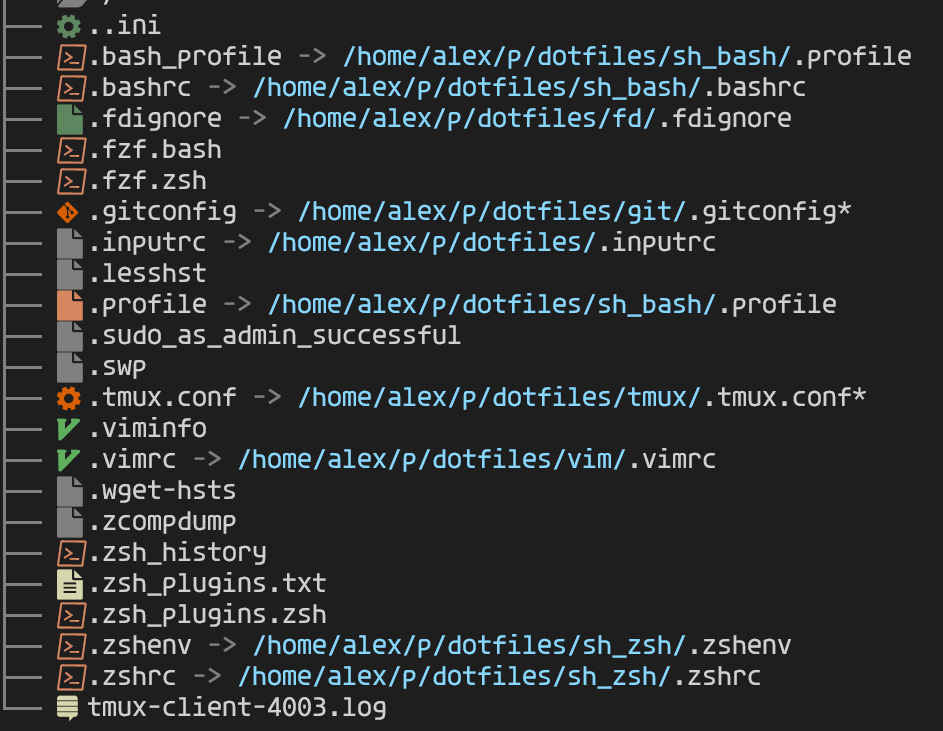
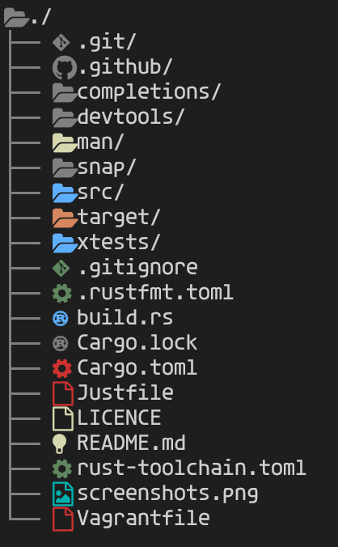
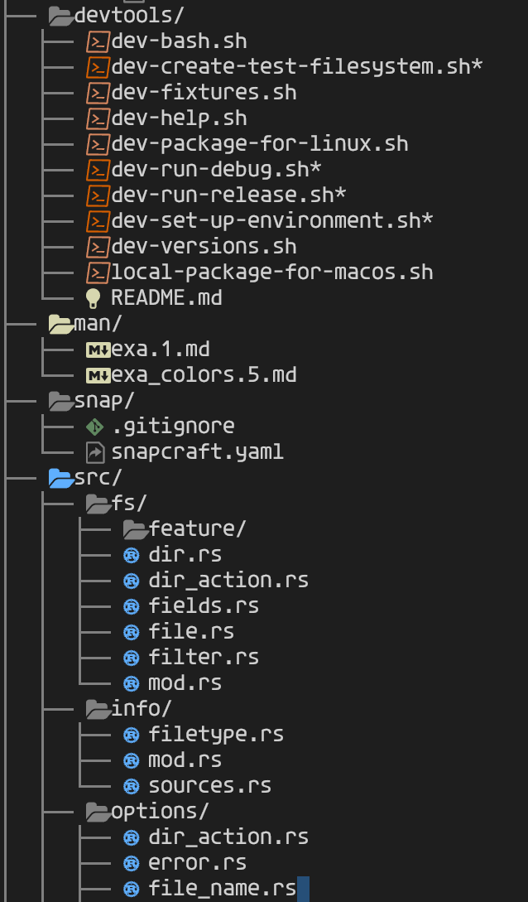
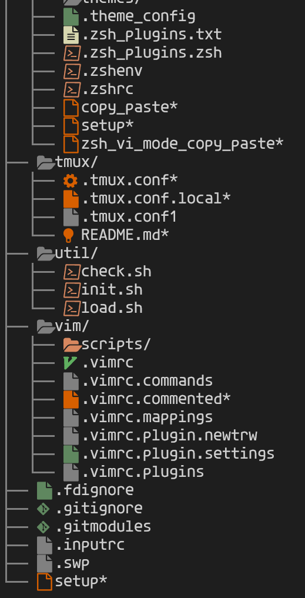

<div align="left">

# exa

[exa](https://the.exa.website/) is a modern replacement for _ls_.
https://github.com/ogham/exa

# fork
- removed text colorazing, only icons are colored.
- Added directory colors.
- Support correct colors for linked files (file would have executable color, if link leads to executable, e.t.c.)

- I loved vscode default dark theme, so I fixed colours for it
- background #1E1E1E 
- I used colors for files and folders with same logic
- files:
    - blue - files for most languages
    - orange - shell scripts - bash, zsh, profile
    - bright orange - executed files
    - light yellow - documents to read, md, readme, txt, log, e.t.c.
    - dark green - configs - yml, git files, themes, settings, e.t.c, added regex there
    - gold yellow - files with pretty data - json, xml, sql, e.t.c
- folders:
    - blue - folder, which contains code, src, test
    - dark green - folder with configs (only docker added)
    - light orange - folder for executions - target, bin, script
    - light yellow - folder with docs - man, doc
Played a bit with regex file-name parsing:
- file contains `.*vim.*` at extension would have correct color and icon, .vimrc, .vimscript, .vim.mapping, e.t.c
- file contains bash, zsh, sh - script files
```
r".*bash.*",
r".*zsh.*",
r"^sh_",
r"_sh$",
```
- file contains following things - config file
```
r".*ignore",
r".*settings.*",
r".*theme.*",
r".*settings.*",
r".*theme.*",
```
- folder contains `.*test.*` - folder with language files
- folder contains `.*script.*` - folder with execution files
- folder contains `man.*` - folder with docs files





